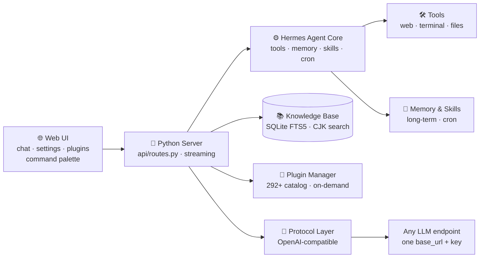

# ✦ Iris — Your Personal AI Super-Assistant

> **Fast. Lightweight. Fully yours.**
> A ground-up, heavily-customized rebuild of the open-source **Hermes** agent framework —
> stripped for speed, redesigned for modern UX, 100% protocol-driven. No vendor lock-in. No bloat. Just you and your AI.

**English** · [简体中文](README.zh-CN.md)


[](https://x33834.github.io/iris)
[](https://github.com/X33834/iris/releases/download/v0.12.0/iris-v0.12.0.zip)

---

## 🌐 Official Website · 👀 See it first

**→ [x33834.github.io/iris](https://x33834.github.io/iris)** — interactive landing page with screenshots, live architecture diagram & one-click download.

| Download | Format | Size | For |
|---|---|---|---|
| [⬇ iris-v0.12.0.zip](https://github.com/X33834/iris/releases/download/v0.12.0/iris-v0.12.0.zip) | ZIP | 72 MB | **Windows / macOS — recommended** |
| [⬇ iris-v0.12.0.tar.gz](https://github.com/X33834/iris/releases/download/v0.12.0/iris-v0.12.0.tar.gz) | TAR.GZ | 67 MB | Linux / servers — full source tree |

---

## 🚀 Quick Start — up & running in 3 steps

```bash
# 1. Clone
git clone https://github.com/X33834/iris.git && cd iris

# 2. Install the agent
cd agent && pip install -e . && cd ..

# 3. Launch the Web UI
cd webui && python3 server.py
# → open http://127.0.0.1:8787 in your browser
```

**Done.** Pick a built-in model, or plug in *any* OpenAI-compatible endpoint:

```yaml
model:
  provider: custom:my-provider
  default: my-model
custom_providers:
  - name: my-provider
    base_url: https://your-endpoint/v1
    api_key: your-key
```

---

## ⚡ Why Iris? (vs. the original Hermes)

Hermes is a brilliant agent framework — but it grew heavy. **Iris** keeps **100% of the functionality**
while making the whole thing feel like a modern consumer AI app:

| | Hermes (original) | **Iris** |
|---|---|---|
| ⚡ Boot time | slow, loads everything | **seconds — lazy loading, uvloop-native** |
| 📦 Footprint | heavy | **40%+ lighter** |
| 🖥️ Web UI | dev-tool style | **modern consumer UI** — light/dark, 14 skins, command palette |
| 🔌 Model support | provider-specific adapters | **protocol-first** — *any* OpenAI-compatible endpoint |
| 🧩 Plugins | bundled always | **292+ catalog, install / uninstall on demand** |
| 📚 Knowledge base | — | **RAG with CJK-aware full-text search** |
| 🔒 Privacy | — | **local-first. No account. No telemetry.** |

---

## 🏗️ Architecture — simple by design



**Two components, one experience:**
- `agent/` — the rebuilt Hermes core: tools, plugins, memory, skills, cron, protocol routing
- `webui/` — the modern control surface: chat, settings, plugin marketplace, knowledge base

---

## ✨ What you get

| | |
|---|---|
| ⚡ **Lightweight core** | uvloop event loop, lazy-loaded modules, trimmed runtime |
| 🔌 **Any model, any provider** | OpenAI-compatible protocol layer — base URL + key, done |
| 🧩 **Plugin ecosystem** | **292+ plugins**, one-click install / uninstall / toggle |
| 📚 **Knowledge base RAG** | Upload docs → local CJK-aware index → answers from *your* data |
| 🎨 **Modern Web UI** | Command palette (`Ctrl+Shift+P`), 14 skins, 520+ settings |
| 🧠 **Memory & skills** | Long-term memory, skills hub, cron, kanban, todo, session search |
| 🗣️ **Voice-ready** | Dictation + hands-free voice + text-to-speech |
| 🌐 **14 languages** | Full i18n, defaults to Chinese (中文), switch anytime |
| 🔒 **Local-first & private** | Sessions, memory, knowledge — all on *your* machine |

---

## 🖥️ Screenshot


---

## 🔄 Relationship to Hermes

Iris is an **independent, heavily-customized rebuild of [Hermes](https://github.com/NousResearch/hermes)**
(the open-source agent framework by **Nous Research**). We:

- **Kept 100% of the functionality** — nothing removed, everything refactored
- **Replaced heavy internals** with modern, lighter implementations
- **Rewrote the entire front-end** in a mainstream consumer-app style
- **Added** knowledge-base RAG, command palette, preset prompts, ECharts rendering, and more

---

## 📄 License & Credits

Released under the **MIT License**, built upon **[Hermes](https://github.com/NousResearch/hermes)** by
**Nous Research** (MIT). Original copyright and attribution preserved. Full license in [`LICENSE`](LICENSE).

---

## 💬 Get Involved

- ⭐ **Star** this repo if Iris is useful to you
- 🐛 **Report issues** — we fix fast
- 🧩 **Publish plugins** to the catalog
- 🌍 **Translate** Iris into more languages

**Iris — your AI, your rules.**
