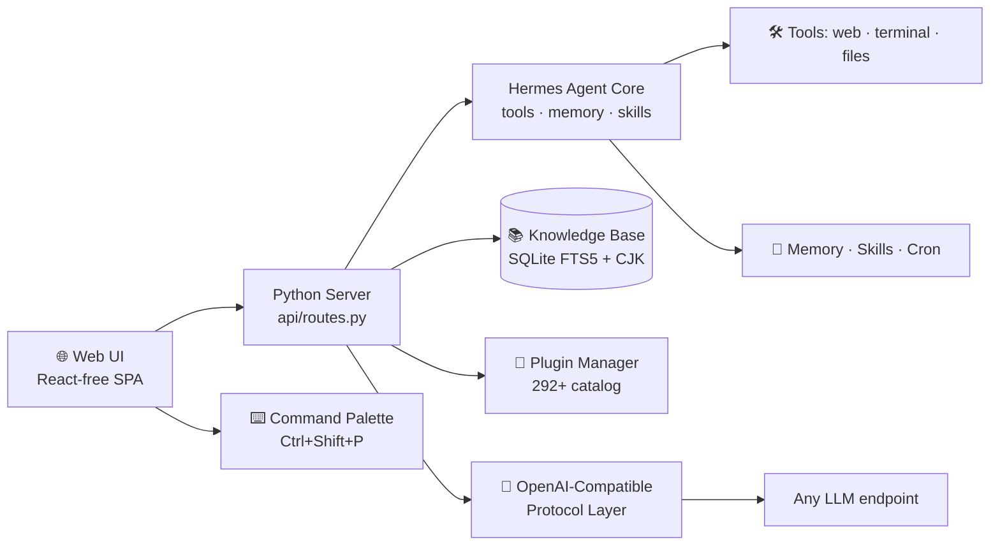

# ✦ Iris — Your Personal AI Super-Assistant

> **Fast. Lightweight. Fully yours.**
> A ground-up rebuild of the open-source **Hermes** agent framework — stripped for speed,
> redesigned for modern UX, and 100% protocol-driven. No vendor lock-in. No bloat. Just you and your AI.


---

## Why Iris?

Hermes is a brilliant agent framework — but it grew heavy. **Iris** is a full-scale rebuild that keeps
**every capability** while making the experience feel like a modern consumer AI app:

- **40%+ lighter** than the original footprint — boots in seconds, sips memory
- **Protocol-first, model-agnostic** — works with *any* OpenAI-compatible endpoint (one line of config)
- **Consumer-grade UI** — clean light/dark themes, 14 skins, command palette, instant responses
- **100% open source** — MIT licensed, no accounts, no telemetry, no cloud lock-in

> 🇨🇳 **Chinese users welcome**: fully localized UI (中文界面), domestic search providers built in,
> no dependency on overseas services.

---

## ✨ Highlights

| | |
|---|---|
| ⚡ **Lightweight core** | uvloop-native event loop, lazy-loaded modules, trimmed runtime |
| 🔌 **Any model, any provider** | OpenAI-compatible protocol layer — plug in a base URL + key, done |
| 🧩 **Plugin ecosystem** | **292+ plugins** in the official catalog, one-click install / uninstall / toggle |
| 📚 **Knowledge base (RAG)** | Upload docs → local SQLite FTS5 index (CJK-aware) → agent answers from *your* data |
| 🎨 **Modern Web UI** | Command palette (`Ctrl+Shift+P`), 4 themes × 14 skins, 3 font sizes, 520+ settings |
| 🧠 **Memory & skills** | Long-term memory, skills hub, cron jobs, kanban, todo, session search |
| 🗣️ **Voice-ready** | Dictation + hands-free voice mode + text-to-speech |
| 🌐 **14 languages** | Full i18n, defaults to Chinese (中文), switch anytime |
| 🔒 **Local-first & private** | Sessions, memory and knowledge stay on *your* machine |

---

## 🚀 Quick Start

```bash
# 1. Clone
git clone https://github.com/x33834/iris.git
cd iris

# 2. Install the agent
cd agent && pip install -e . && cd ..

# 3. Start the Web UI
cd webui && python3 server.py
# → open http://127.0.0.1:8787
```

That's it. Create a session, pick your model (or add a custom OpenAI-compatible endpoint),
and start chatting.

**Add your own model (protocol-first):**

```yaml
model:
  provider: custom:my-provider
  default: my-model
  base_url: https://your-endpoint/v1
custom_providers:
  - name: my-provider
    base_url: https://your-endpoint/v1
    api_key: your-key
```

---

## 🏗️ Architecture



**Two components, one experience:**

- `agent/` — the rebuilt Hermes core: tools, plugins, memory, skills, cron, multi-provider routing
- `webui/` — the modern control surface: chat, settings, plugin marketplace, knowledge base, command palette

---

## 🖥️ Screenshot


---

## 🔄 Relationship to Hermes

Iris is an independent, heavily customized rebuild of **[Hermes](https://github.com/NousResearch/hermes)**
(the open-source agent framework by Nous Research). We:

- **Kept 100% of the functionality** — nothing removed, everything refactored
- **Replaced heavy internals** with modern, lighter implementations
- **Rewrote the entire front-end** in a mainstream consumer-app style
- **Added** knowledge base RAG, command palette, preset prompts, ECharts rendering, and more

---

## 📄 License & Credits

Iris is released under the **MIT License**, built upon **[Hermes](https://github.com/NousResearch/hermes)**
by **Nous Research** (MIT). Original copyright and attribution preserved.

---

## 💬 Get Involved

- ⭐ Star this repo if Iris is useful to you
- 🐛 Report issues — we fix fast
- 🧩 Publish plugins to the catalog
- 🌍 Help translate to more languages

**Iris — your AI, your rules.**
