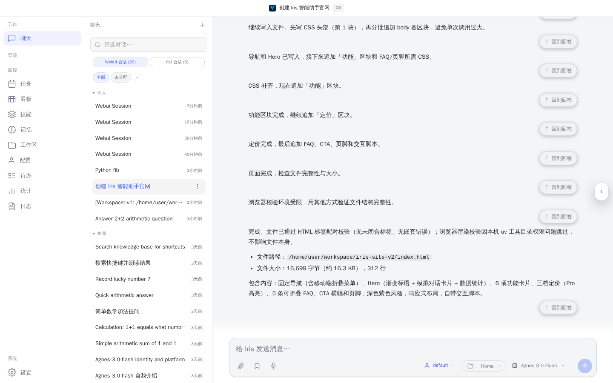
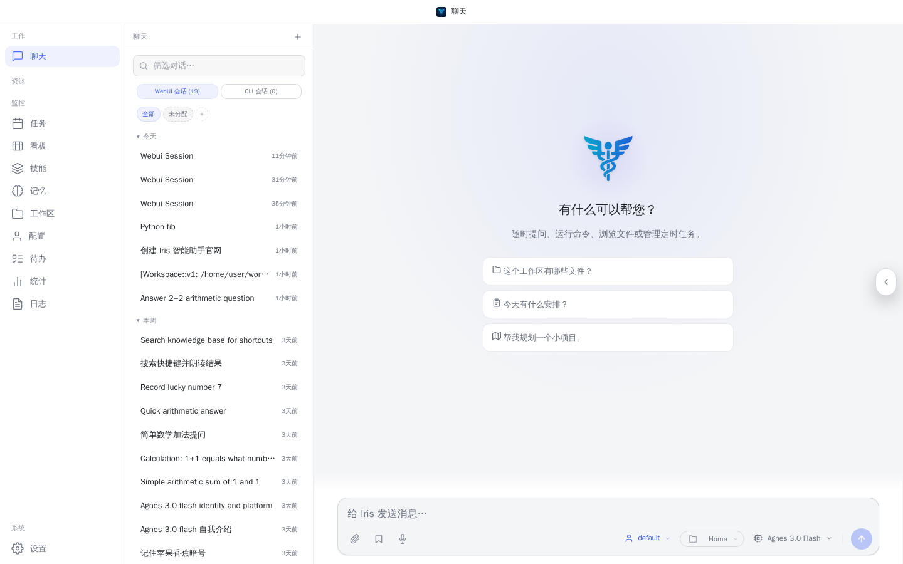
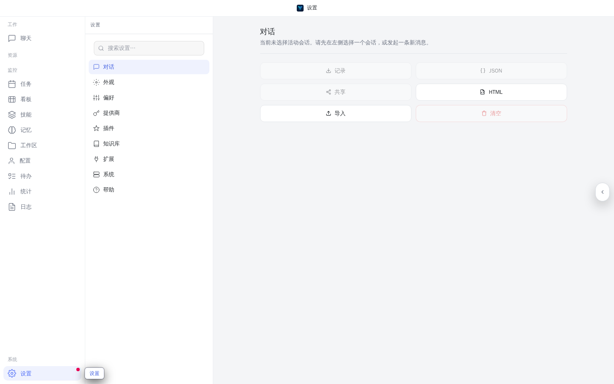
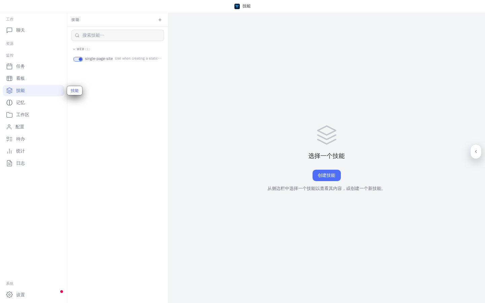
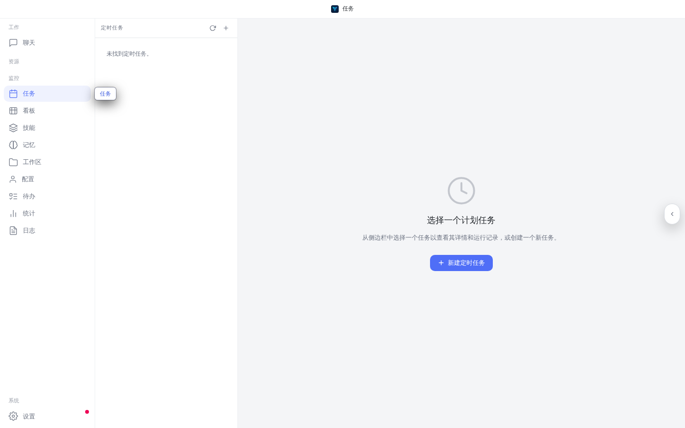
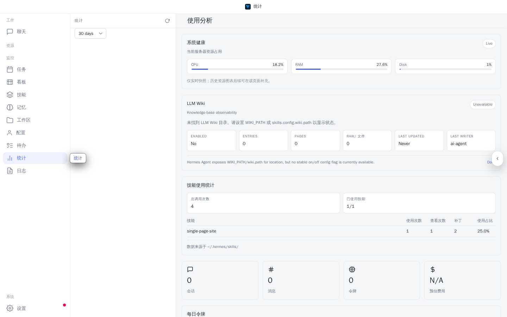
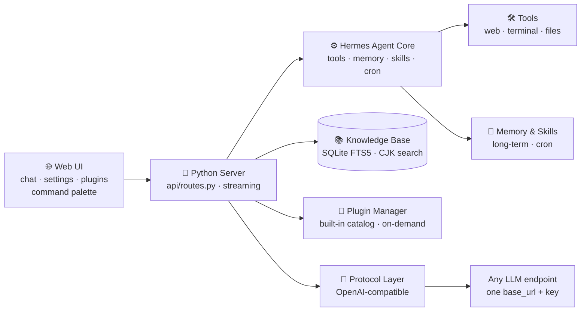

# ✦ Iris — Your Personal AI Super-Assistant

> **Fast. Lightweight. Fully yours.**
> The Iris distribution of the open-source **Hermes** agent framework —
> a fully rewritten, consumer-grade web UI on a lean local-first core.
> 100% protocol-driven, no vendor lock-in, no bloat. Just you and your AI.

**English** · [简体中文](README.zh-CN.md)


[](https://gitcode.com/badhope/iris)
[](https://gitcode.com/badhope/iris/releases)

---

## 🖥️ See it in action

**A real task, done end-to-end** — Iris planned, wrote, verified and reported a complete
single-page website, recovering on its own from a stream drop, an oversized write and a
sandbox permission limit along the way:



<video src="assets/demo/iris-demo.mp4" controls width="720"></video>

## 📸 Screenshots

| Main workspace | Settings | Skills hub |
|---|---|---|
|  |  |  |

| Scheduled tasks | Usage analytics | Mobile |
|---|---|---|
|  |  |  |

---

## 🌐 Official Repo · 👀 See it first

**→ [gitcode.com/badhope/iris](https://gitcode.com/badhope/iris)** — the official home on GitCode: source, releases, issues, and the in-repo landing page (`docs/`).

| Download | Format | For |
|---|---|---|
| [⬇ Latest release — ZIP](https://gitcode.com/badhope/iris/releases) | ZIP | **Windows / macOS — recommended** |
| [⬇ Latest release — TAR.GZ](https://gitcode.com/badhope/iris/releases) | TAR.GZ | Linux / servers — full source tree |

> Building from source (`git clone` + `pip install -e ./agent`) always gives you the newest fixes.
> Release archives track tagged versions; feature counts in this README intentionally stay
> number-free because the project ships continuously.

---

## 🚀 Quick Start — up & running in 3 steps

```bash
# 1. Clone
git clone https://gitcode.com/badhope/iris.git && cd iris

# 2. Install the agent
cd agent && pip install -e . && cd ..

# 3. Launch the Web UI
cd webui && python3 server.py
# → open http://127.0.0.1:8787 in your browser
```

**Done.** Pick a built-in model, or plug in *any* OpenAI-compatible endpoint:

```yaml
model:
  provider: custom:my-provider
  default: my-model
custom_providers:
  - name: my-provider
    base_url: https://your-endpoint/v1
    api_key: your-key
```

> 📘 Full setup, provider wiring, image generation, approvals and troubleshooting live in
> **[`docs/`](docs/)** — start with [`docs/quickstart.md`](docs/quickstart.md).

---

## ⚡ Why Iris? (vs. the original Hermes)

Hermes is a brilliant agent framework — but it grew heavy. **Iris** keeps the full Hermes core
while making the whole thing feel like a modern consumer AI app:

| | Hermes (original) | **Iris** |
|---|---|---|
| ⚡ Boot time | slow, loads everything | **seconds — lazy loading, uvloop-native** |
| 📦 Footprint | heavy | **leaner — web UI needs only pyyaml + cryptography** |
| 🖥️ Web UI | dev-tool style | **modern consumer UI** — light/dark + many skins, command palette |
| 🔌 Model support | provider-specific adapters | **protocol-first** — *any* OpenAI-compatible endpoint |
| 🧩 Plugins | bundled always | **built-in catalog, install / uninstall on demand** |
| 📚 Knowledge base | — | **RAG with CJK-aware full-text search** |
| 🔒 Privacy | — | **local-first. No account. No telemetry.** |

---

## 🏗️ Architecture — simple by design


```mermaid
flowchart LR
    U["🌐 Web UI<br/>chat · settings · plugins<br/>command palette"] --> S["🐍 Python Server<br/>api/routes.py · streaming"]
    S --> A["⚙️ Hermes Agent Core<br/>tools · memory · skills · cron"]
    S --> KB[("📚 Knowledge Base<br/>SQLite FTS5 · CJK search")]
    S --> PM["🧩 Plugin Manager<br/>built-in catalog · on-demand"]
    S --> PL["🤖 Protocol Layer<br/>OpenAI-compatible"]
    PL --> M["Any LLM endpoint<br/>one base_url + key"]
    A --> T1["🛠️ Tools<br/>web · terminal · files"]
    A --> T2["🧠 Memory & Skills<br/>long-term · cron"]
```

**Two components, one experience:**
- `agent/` — the rebuilt Hermes core: tools, plugins, memory, skills, cron, protocol routing
- `webui/` — the modern control surface: chat, settings, plugin marketplace, knowledge base

---

## ✨ What you get

| | |
|---|---|
| ⚡ **Lightweight core** | uvloop event loop, lazy-loaded modules, trimmed runtime |
| 🔌 **Any model, any provider** | OpenAI-compatible protocol layer — base URL + key, done |
| 🧩 **Plugin ecosystem** | **Built-in catalog**, one-click install / uninstall / toggle |
| 📚 **Knowledge base RAG** | Upload docs → local CJK-aware index → answers from *your* data |
| 🎨 **Modern Web UI** | Command palette (`Ctrl+Shift+P`), light/dark + many skins, rich settings |
| 🧠 **Memory & skills** | Long-term memory, skills hub, cron, kanban, todo, session search |
| 🗣️ **Voice-ready** | Dictation + hands-free voice + text-to-speech |
| 🌐 **Multi-language** | Full i18n, defaults to Chinese (中文), switch anytime |
| 🔒 **Local-first & private** | Sessions, memory, knowledge — all on *your* machine |

---

## 🔄 Relationship to Hermes

Iris is an **independent, deeply-customized distribution of [Hermes](https://github.com/NousResearch/hermes-agent)**
(the open-source agent framework by **Nous Research**). We:

- **Kept the full Hermes core** — upstream module layout is preserved so upstream fixes merge cleanly
- **Rewrote the entire front-end** in a mainstream consumer-app style
- **Slimmed the deploy surface** — the web UI runs on two Python deps; heavy providers stay optional
- **Added** knowledge-base RAG, command palette, preset prompts, ECharts rendering, and more

---

## 📚 Documentation

| Doc | What it covers |
|---|---|
| [`docs/quickstart.md`](docs/quickstart.md) | Install, first run, model setup |
| [`docs/configuration.md`](docs/configuration.md) | `config.yaml` reference — providers, image gen, approvals |
| [`docs/usage.md`](docs/usage.md) | Daily use — chat, tools, tasks, kanban, memory, skills |
| [`docs/faq.md`](docs/faq.md) | Common issues & fixes (rate limits, stalls, upgrades) |

---

## 📄 License & Credits

Released under the **MIT License**, built upon **[Hermes](https://github.com/NousResearch/hermes-agent)** by
**Nous Research** (MIT). Original copyright and attribution preserved. Full license in [`LICENSE`](LICENSE).

---

## 💬 Get Involved

- ⭐ **Star** this repo if Iris is useful to you
- 🐛 **Report issues** — we fix fast
- 🧩 **Publish plugins** to the catalog
- 🌍 **Translate** Iris into more languages

**Iris — your AI, your rules.**
