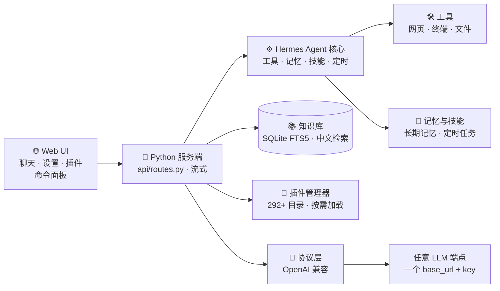

# ✦ Iris — 你的个人 AI 超级助手

> **快 · 轻 · 完全属于你。**
> 基于开源 **Hermes** 智能体框架的全面深度重构——追求极致速度、现代交互体验、100% 协议驱动。
> 不绑定厂商、不臃肿。只有你，和你的 AI。

[English](README.md) · **简体中文**


[](https://x33834.github.io/iris)
[](https://github.com/X33834/iris/releases/download/v0.12.0/iris-v0.12.0.zip)

---

## 🌐 官方网站 · 先睹为快

**→ [x33834.github.io/iris](https://x33834.github.io/iris)** — 交互式落地页：真实截图、动态架构图、一键下载。

| 下载 | 格式 | 大小 | 适用 |
|---|---|---|---|
| [⬇ iris-v0.12.0.zip](https://github.com/X33834/iris/releases/download/v0.12.0/iris-v0.12.0.zip) | ZIP | 72 MB | **Windows / macOS — 推荐** |
| [⬇ iris-v0.12.0.tar.gz](https://github.com/X33834/iris/releases/download/v0.12.0/iris-v0.12.0.tar.gz) | TAR.GZ | 67 MB | Linux / 服务器 — 完整源码树 |

---

## 🚀 快速开始 — 三步上手

```bash
# 1. 克隆
git clone https://github.com/X33834/iris.git && cd iris

# 2. 安装 agent 核心
cd agent && pip install -e . && cd ..

# 3. 启动 Web UI
cd webui && python3 server.py
# → 浏览器打开 http://127.0.0.1:8787
```

**搞定。** 选择内置模型，或接入*任意* OpenAI 兼容端点：

```yaml
model:
  provider: custom:my-provider
  default: my-model
custom_providers:
  - name: my-provider
    base_url: https://your-endpoint/v1
    api_key: your-key
```

---

## ⚡ 为什么选 Iris？（对比原版 Hermes）

Hermes 是杰出的智能体框架——但它越来越重。**Iris** 保留 **100% 的功能**，同时让整体体验向现代消费级 AI 应用看齐：

| | Hermes（原版） | **Iris** |
|---|---|---|
| ⚡ 启动速度 | 慢，全量加载 | **秒级 — 懒加载 + uvloop** |
| 📦 体积 | 臃肿 | **轻 40% 以上** |
| 🖥️ Web UI | 开发工具风格 | **现代消费级界面** — 亮/暗主题、14 款皮肤、命令面板 |
| 🔌 模型支持 | 逐厂商适配器 | **协议优先** — 任意 OpenAI 兼容端点即插即用 |
| 🧩 插件 | 全部内置 | **292+ 目录，按需安装/卸载** |
| 📚 知识库 | 无 | **RAG + 中文精准全文检索** |
| 🔒 隐私 | — | **本地优先。无账号。无遥测。** |

---

## 🏗️ 架构 — 简洁设计



**两个组件，一套无缝体验：**
- `agent/` — 重构后的 Hermes 核心：工具、插件、记忆、技能、定时、协议路由
- `webui/` — 现代控制界面：聊天、设置、插件市场、知识库

---

## ✨ 你能得到什么

| | |
|---|---|
| ⚡ **轻量内核** | uvloop 事件循环、模块懒加载、精简运行时 |
| 🔌 **任意模型任意厂商** | OpenAI 兼容协议层 — 填 base_url + key 即用 |
| 🧩 **插件生态** | **292+ 插件**，一键安装 / 卸载 / 启停 |
| 📚 **知识库 RAG** | 上传文档 → 本地中文索引 → 基于*你的数据*作答 |
| 🎨 **现代 Web UI** | 命令面板（`Ctrl+Shift+P`）、14 款皮肤、520+ 设置项 |
| 🧠 **记忆与技能** | 长期记忆、技能中心、定时任务、看板、待办、会话搜索 |
| 🗣️ **语音就绪** | 语音输入 + 免提语音模式 + 语音合成 |
| 🌐 **14 种语言** | 完整国际化，默认中文，随时切换 |
| 🔒 **本地优先 · 私密** | 会话、记忆、知识全部留在*你的机器* |

---

## 🖥️ 界面截图


---

## 🔄 与 Hermes 的关系

Iris 是 **[Hermes](https://github.com/NousResearch/hermes)**（Nous Research 的开源智能体框架）的
**独立深度定制重构**。我们：

- **保留了 100% 的功能** — 没有删减，全部重构
- **替换沉重内部实现** — 换成现代轻量方案
- **重写整个前端** — 主流消费应用风格
- **新增**知识库 RAG、命令面板、预设提示词、ECharts 图表渲染等

---

## 📄 许可与致谢

采用 **MIT License**，基于 **[Hermes](https://github.com/NousResearch/hermes)**（**Nous Research**，MIT）构建。
保留原始版权与署名。完整协议见 [`LICENSE`](LICENSE)。

---

## 💬 参与贡献

- ⭐ 觉得 Iris 有用就 **Star** 一下
- 🐛 **提 Issue** — 我们快速修复
- 🧩 向插件目录 **发布插件**
- 🌍 帮助 Iris **翻译**成更多语言

**Iris — 你的 AI，你的规则。**
