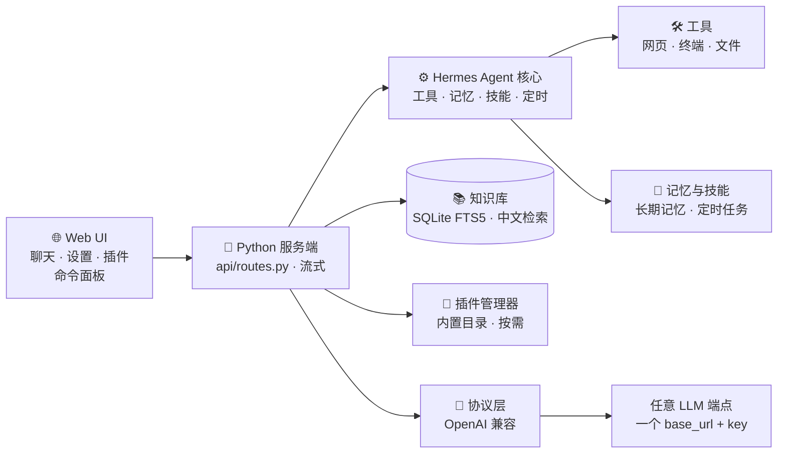

# ✦ Iris — 你的个人 AI 超级助手

> **快 · 轻 · 完全属于你。**
> 开源 **Hermes** 智能体框架的 Iris 发行版——全新重写的消费级 Web UI，叠加精简的本地优先内核。
> 100% 协议驱动、不绑定厂商、不臃肿。只有你，和你的 AI。

[English](README.md) · **简体中文**


[](https://gitcode.com/badhope/iris)
[](https://gitcode.com/badhope/iris/releases)

---

## 🖥️ 真实演示

**一次真实任务的完整执行** —— Iris 独立完成了整站开发：规划、分批写入、校验、总结汇报，
途中自动处理了流式截断、超大文件写入和沙箱权限限制等环境问题：


<video src="assets/demo/iris-demo.mp4" controls width="720"></video>

## 📸 界面截图

| 主工作台 | 设置 | 技能中心 |
|---|---|---|
|  |  |  |

| 定时任务 | 用量统计 | 移动端 |
|---|---|---|
|  |  |  |

---

## 🌐 官方仓库 · 先睹为快

**→ [gitcode.com/badhope/iris](https://gitcode.com/badhope/iris)** — GitCode 官方主页：源码、发布、Issue，以及仓库内落地页（`docs/`）。

| 下载 | 格式 | 适用 |
|---|---|---|
| [⬇ 最新 Release — ZIP](https://gitcode.com/badhope/iris/releases) | ZIP | **Windows / macOS — 推荐** |
| [⬇ 最新 Release — TAR.GZ](https://gitcode.com/badhope/iris/releases) | TAR.GZ | Linux / 服务器 — 完整源码树 |

> 从源码构建（`git clone` + `pip install -e ./agent`）永远获得最新修复。
> Release 归档对应打标签的版本；本 README 刻意不写特性数量——项目持续更新，数字会过时。

---

## 🚀 快速开始 — 三步上手

```bash
# 1. 克隆
git clone https://gitcode.com/badhope/iris.git && cd iris

# 2. 安装 agent 核心
cd agent && pip install -e . && cd ..

# 3. 启动 Web UI
cd webui && python3 server.py
# → 浏览器打开 http://127.0.0.1:8787
```

**完成。** 直接选用内置模型，或接入 *任意* OpenAI 兼容端点：

```yaml
model:
  provider: custom:my-provider
  default: my-model
custom_providers:
  - name: my-provider
    base_url: https://your-endpoint/v1
    api_key: your-key
```

> 📘 完整安装、提供商接入、图像生成、审批与故障排查见
> **[`docs/`](docs/)** —— 从 [`docs/quickstart.md`](docs/quickstart.md) 开始。

---

## ⚡ 为什么选择 Iris？（对比原版 Hermes）

Hermes 是出色的智能体框架——但越来越重。**Iris** 保留完整 Hermes 内核，
同时把整体体验打磨成现代消费级 AI 应用：

| | Hermes（原版） | **Iris** |
|---|---|---|
| ⚡ 启动速度 | 慢，全量加载 | **秒级——懒加载 + uvloop** |
| 📦 体积 | 重 | **更轻——Web UI 仅需 pyyaml + cryptography** |
| 🖥️ Web UI | 开发工具风格 | **现代消费级 UI** —— 亮/暗 + 多款皮肤、命令面板 |
| 🔌 模型支持 | 分厂商适配器 | **协议优先** —— *任意* OpenAI 兼容端点 |
| 🧩 插件 | 总是全量捆绑 | **内置目录，按需安装 / 卸载** |
| 📚 知识库 | — | **RAG + 中文感知全文检索** |
| 🔒 隐私 | — | **本地优先。无账号。无遥测。** |

---

## 🏗️ 架构 — 简洁设计


```mermaid
flowchart LR
    U["🌐 Web UI<br/>聊天 · 设置 · 插件<br/>命令面板"] --> S["🐍 Python 服务端<br/>api/routes.py · 流式"]
    S --> A["⚙️ Hermes Agent 核心<br/>工具 · 记忆 · 技能 · 定时"]
    S --> KB[("📚 知识库<br/>SQLite FTS5 · 中文检索")]
    S --> PM["🧩 插件管理器<br/>内置目录 · 按需"]
    S --> PL["🤖 协议层<br/>OpenAI 兼容"]
    PL --> M["任意 LLM 端点<br/>一个 base_url + key"]
    A --> T1["🛠️ 工具<br/>网页 · 终端 · 文件"]
    A --> T2["🧠 记忆与技能<br/>长期记忆 · 定时任务"]
```

**两大组件，一个体验：**
- `agent/` — 重构后的 Hermes 核心：工具、插件、记忆、技能、定时任务、协议路由
- `webui/` — 现代控制面：聊天、设置、插件市场、知识库

---

## ✨ 你能得到什么

| | |
|---|---|
| ⚡ **轻量内核** | uvloop 事件循环、模块懒加载、精简运行时 |
| 🔌 **任意模型、任意提供商** | OpenAI 兼容协议层 —— 填 base URL + key 即可 |
| 🧩 **插件生态** | **内置目录**，一键安装 / 卸载 / 启停 |
| 📚 **知识库 RAG** | 上传文档 → 本地中文索引 → 从*你的*数据作答 |
| 🎨 **现代 Web UI** | 命令面板（`Ctrl+Shift+P`）、亮/暗 + 多款皮肤、丰富设置项 |
| 🧠 **记忆与技能** | 长期记忆、技能中心、定时任务、看板、待办、会话搜索 |
| 🗣️ **语音就绪** | 语音输入 + 免提语音 + 文字转语音 |
| 🌐 **多语言** | 完整 i18n，默认中文，随时切换 |
| 🔒 **本地优先、私密** | 会话、记忆、知识库 —— 全部在你的机器上 |

---

## 🔄 与 Hermes 的关系

Iris 是 **[Hermes](https://github.com/NousResearch/hermes-agent)**（Nous Research 的开源智能体框架）的
**独立深度定制发行版**。我们：

- **保留完整 Hermes 内核** —— 上游模块布局保留，上游修复可干净合入
- **全量重写前端** —— 主流消费应用风格
- **精简部署面** —— Web UI 仅两个 Python 依赖；重提供商保持可选
- **新增** —— 知识库 RAG、命令面板、预设提示词、ECharts 渲染等

---

## 📚 文档

| 文档 | 内容 |
|---|---|
| [`docs/quickstart.md`](docs/quickstart.md) | 安装、首次运行、模型配置 |
| [`docs/configuration.md`](docs/configuration.md) | `config.yaml` 参考 —— 提供商、图像生成、审批 |
| [`docs/usage.md`](docs/usage.md) | 日常使用 —— 聊天、工具、任务、看板、记忆、技能 |
| [`docs/faq.md`](docs/faq.md) | 常见问题与解决（限流、卡顿、升级） |

---

## 📄 许可与致谢

采用 **MIT 许可**，基于 **[Hermes](https://github.com/NousResearch/hermes-agent)**（Nous Research，MIT）构建。
保留原始版权与署名。完整许可见 [`LICENSE`](LICENSE)。

---

## 💬 参与进来

- ⭐ **Star** 本仓库，如果 Iris 对你有用
- 🐛 **提交 Issue** —— 我们修复很快
- 🧩 **发布插件** 到目录
- 🌍 **翻译** Iris 到更多语言

**Iris —— 你的 AI，你的规则。**
