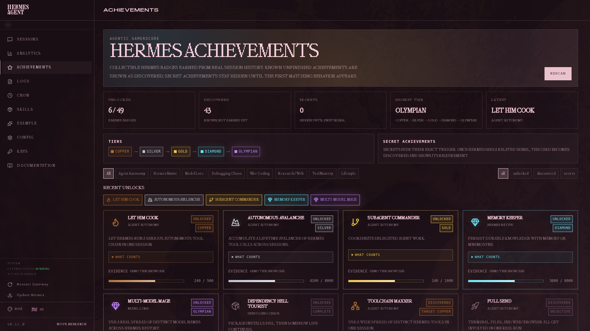

# Iris Achievements

> **Bundled with Iris Agent.** Originally authored by [@PCinkusz](https://github.com/PCinkusz) at https://github.com/PCinkusz/hermes-achievements — vendored into `plugins/iris-achievements/` so it ships with the dashboard out-of-the-box and stays in lockstep with Iris feature changes. Upstream repo remains the staging ground for new badges and UI iteration.
>
> When Iris is installed via the install script or cloned from source, this plugin auto-registers as a dashboard tab on first `iris dashboard` launch. No separate install step. For the bundled-plugins overview, see the repository root `README.md` and `docs/`.

Achievement system for the Iris Dashboard: collectible, tiered badges generated from real local Iris session history.



The screenshots use temporary demo tier data to show the full visual range. The plugin itself reads real local Iris session history by default.

> **Update notice (2026-04-29):** If you installed this plugin before today, update to the latest version. The achievements scan path was refactored for much faster warm loads (snapshot cache + incremental checkpoint scan).
>
> **Share cards (2026-05-04, vendored in iris-agent v0.4.0):** Unlocked achievement cards now have a "Share" button that renders a 1200×630 PNG share card (client-side canvas, no backend, no network) with Download + Copy-to-clipboard actions. Fits X/Twitter, Discord, LinkedIn, Bluesky link-preview dimensions.

## What it does

Iris Achievements scans local Iris sessions and unlocks badges based on real agent behavior:

- autonomous tool chains
- debugging and recovery patterns
- vibe-coding file edits
- Iris-native skills, memory, cron, and plugin usage
- web research and browser automation
- model/provider workflows
- lifestyle patterns such as weekend or night sessions

Achievements have three visible states:

- **Unlocked** — earned at least one tier
- **Discovered** — known achievement, progress visible, not earned yet
- **Secret** — hidden until Iris detects the first related signal

Most achievements level through:

```text
Copper → Silver → Gold → Diamond → Olympian
```

Each card has a collapsible **What counts** section showing the exact tracked metric or requirement once the user wants details.

Version `0.2.x` expands the catalog to 60+ achievements, including model/provider badges such as **Five-Model Flight**, **Provider Polyglot**, **Claude Confidant**, **Gemini Cartographer**, and **Open Weights Pilgrim**.

## Examples

- Let Him Cook
- Toolchain Maxxer
- Red Text Connoisseur
- Port 3000 Is Taken
- This Was Supposed To Be Quick
- One More Small Change
- Skillsmith
- Memory Keeper
- Context Dragon
- Plugin Goblin
- Rabbit Hole Certified

## Install

Clone into your Iris plugins directory:

```bash
git clone https://github.com/PCinkusz/hermes-achievements ~/.iris/plugins/iris-achievements
```

For local development, keep the repo elsewhere and symlink it:

```bash
git clone https://github.com/PCinkusz/hermes-achievements ~/iris-achievements
ln -s ~/iris-achievements ~/.iris/plugins/iris-achievements
```

Then rescan dashboard plugins:

```bash
curl http://127.0.0.1:9119/api/dashboard/plugins/rescan
```

If backend API routes 404, restart `iris dashboard`; plugin APIs are mounted at dashboard startup.

## Updating

If you installed with git:

```bash
cd ~/.iris/plugins/iris-achievements
git pull --ff-only
curl http://127.0.0.1:9119/api/dashboard/plugins/rescan
```

If the update changes backend routes or `plugin_api.py`, restart `iris dashboard` after pulling.

As of 2026-04-29, updating is strongly recommended because scan performance changed significantly:
- removed duplicate `/overview` scan path
- added cached `/achievements` snapshot
- added incremental checkpoint reuse for unchanged sessions

Achievement unlock state is stored locally in `state.json` and is not overwritten by git updates. New achievements are evaluated from your existing Iris session history. Achievement IDs are stable and should not be renamed casually because they are the unlock-state keys.

Releases are tagged in git, for example:

```bash
git fetch --tags
git checkout v0.2.0
```

## Files

```text
dashboard/
├── manifest.json
├── plugin_api.py
└── dist/
    ├── index.js
    └── style.css
```

## API

Routes are mounted under:

```text
/api/plugins/iris-achievements/
```

Endpoints:

```text
GET  /achievements
GET  /scan-status
GET  /recent-unlocks
GET  /sessions/{session_id}/badges
POST /rescan
POST /reset-state
```

## Development

Run checks:

```bash
node --check dashboard/dist/index.js
python3 -m py_compile dashboard/plugin_api.py
python3 -m unittest tests/test_achievement_engine.py -v
```

## License

MIT
